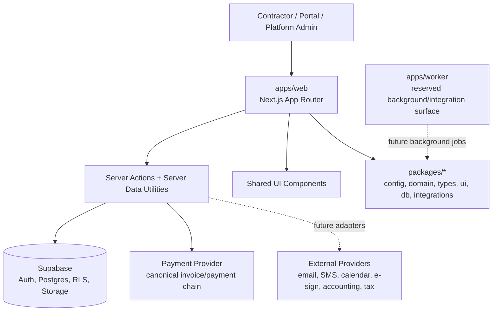

# C4 Container

Status: Active
Doc Type: Operational

This C4-style container diagram shows the current monorepo shape and major runtime boundaries.

```mermaid
flowchart TB
  User["Contractor / Portal / Platform Admin"] --> Web["apps/web\nNext.js App Router"]

  Web --> ServerActions["Server Actions + Server Data Utilities"]
  Web --> UI["Shared UI Components"]
  Web --> Packages["packages/*\nconfig, domain, types, ui, db, integrations"]
  ServerActions --> Supabase[("Supabase\nAuth, Postgres, RLS, Storage")]
  ServerActions --> PaymentProvider["Payment Provider\ncanonical invoice/payment chain"]

  Worker["apps/worker\nreserved background/integration surface"] -. "future background jobs" .-> Packages
  ServerActions -. "future adapters" .-> Integrations["External Providers\nemail, SMS, calendar, e-sign, accounting, tax"]
```

