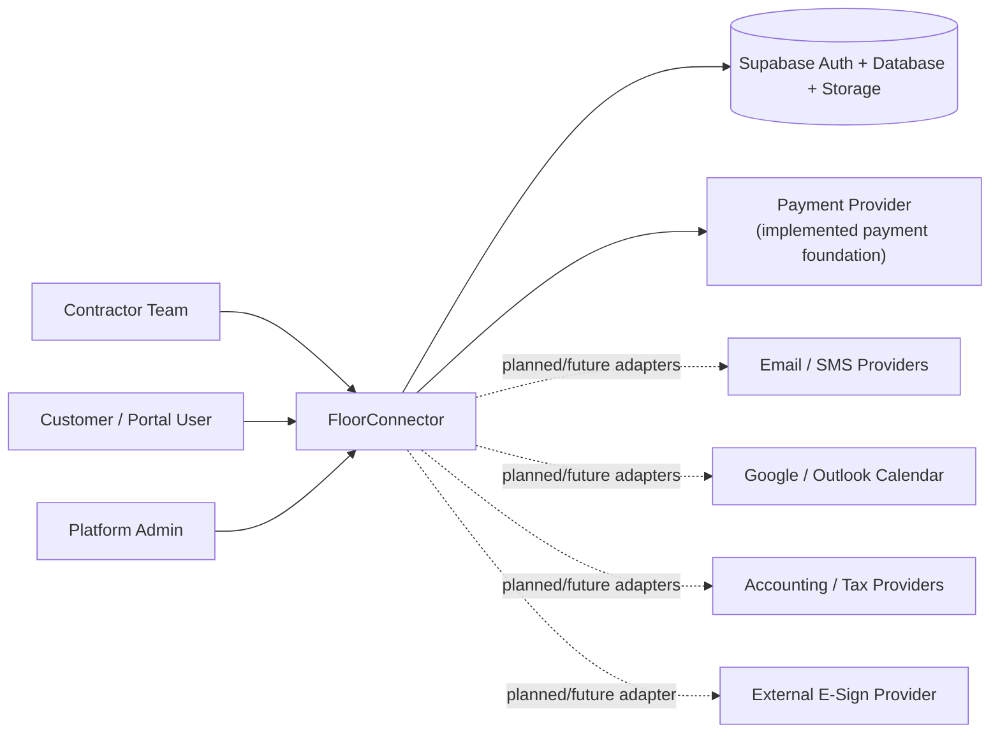

# C4 Context

Status: Active
Doc Type: Operational

This C4-style context diagram shows FloorConnector as one contractor operating system. Future services are labeled explicitly.

```mermaid
flowchart LR
  Contractor["Contractor Team"] --> FC["FloorConnector"]
  Customer["Customer / Portal User"] --> FC
  PlatformAdmin["Platform Admin"] --> FC

  FC --> Supabase[("Supabase Auth + Database + Storage")]
  FC --> PaymentProvider["Payment Provider\n(implemented payment foundation)"]
  FC -. "planned/future adapters" .-> ExternalEmail["Email / SMS Providers"]
  FC -. "planned/future adapters" .-> ExternalCalendar["Google / Outlook Calendar"]
  FC -. "planned/future adapters" .-> AccountingTax["Accounting / Tax Providers"]
  FC -. "planned/future adapter" .-> ExternalESign["External E-Sign Provider"]
```

