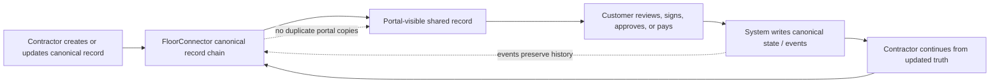

# Shared Record Chain

Status: Active
Doc Type: Operational

This diagram shows the contractor -> system -> customer -> system -> contractor loop.

```mermaid
flowchart LR
  ContractorStart["Contractor creates or updates canonical record"] --> SystemTruth["FloorConnector canonical record chain"]
  SystemTruth --> Portal["Portal-visible shared record"]
  Portal --> CustomerAction["Customer reviews, signs, approves, or pays"]
  CustomerAction --> SystemUpdate["System writes canonical state / events"]
  SystemUpdate --> ContractorContinue["Contractor continues from updated truth"]
  ContractorContinue --> SystemTruth

  SystemTruth -. "no duplicate portal copies" .-> Portal
  SystemUpdate -. "events preserve history" .-> SystemTruth
```

