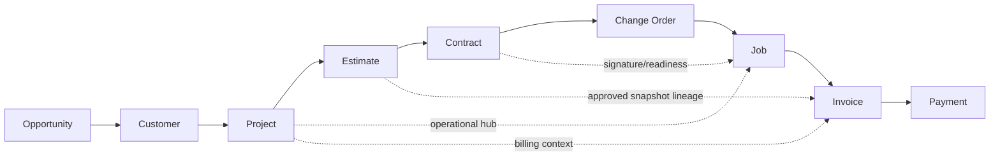

# Workflow Lifecycle

Status: Active
Doc Type: Operational

This diagram shows the canonical FloorConnector lifecycle.

```mermaid
flowchart LR
  Opportunity["Opportunity"] --> Customer["Customer"]
  Customer --> Project["Project"]
  Project --> Estimate["Estimate"]
  Estimate --> Contract["Contract"]
  Contract --> ChangeOrder["Change Order"]
  ChangeOrder --> Job["Job"]
  Job --> Invoice["Invoice"]
  Invoice --> Payment["Payment"]

  Project -. "operational hub" .-> Job
  Project -. "billing context" .-> Invoice
  Estimate -. "approved snapshot lineage" .-> Invoice
  Contract -. "signature/readiness" .-> Job
```

