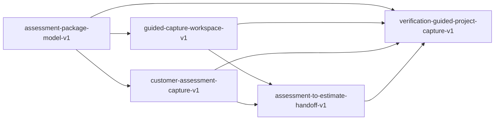

# Guided Project Capture V1 Plan

Status: Approved / Not Started

Doc Type: Review Packet / Wave Plan

Approval date: 2026-06-08

Wave name: `guided-project-capture-v1`

This packet records Jeff approval and Architecture Coordination approval for
stream and worktree creation only. It does not approve implementation start,
schemas, migrations, provider behavior, pull requests, merges, cleanup, or
autonomous actions.

## Rationale

FloorConnector now has stronger downstream operational visibility across
sales-to-production, field execution, closeout, customer trust, collections,
owner reporting, and UX ownership. The highest-leverage remaining upstream gap
is structured project capture before estimating.

Guided Project Capture should reduce estimator rework, missing site context,
customer back-and-forth, and project setup ambiguity by gathering assessment
context around the Project before Estimate consumes it. This is the right next
wave because it strengthens the front of the canonical chain without creating a
separate estimating system or portal-owned source of truth.

## Approved Stream Set

| Stream                                   | Branch                                          | Worktree                                                 | Status                 |
| ---------------------------------------- | ----------------------------------------------- | -------------------------------------------------------- | ---------------------- |
| `assessment-package-model-v1`            | `stream/assessment-package-model-v1`            | `C:\FC-worktrees\assessment-package-model-v1`            | Approved / Not Started |
| `guided-capture-workspace-v1`            | `stream/guided-capture-workspace-v1`            | `C:\FC-worktrees\guided-capture-workspace-v1`            | Approved / Not Started |
| `customer-assessment-capture-v1`         | `stream/customer-assessment-capture-v1`         | `C:\FC-worktrees\customer-assessment-capture-v1`         | Approved / Not Started |
| `assessment-to-estimate-handoff-v1`      | `stream/assessment-to-estimate-handoff-v1`      | `C:\FC-worktrees\assessment-to-estimate-handoff-v1`      | Approved / Not Started |
| `verification-guided-project-capture-v1` | `stream/verification-guided-project-capture-v1` | `C:\FC-worktrees\verification-guided-project-capture-v1` | Approved / Not Started |

All five branches and worktrees were created from the verified current `main`
approval baseline after `git fetch origin`, clean/even `main` confirmation, and
tooling baseline checks. No stream has started implementation.

## Stream Descriptions

### assessment-package-model-v1

- Ownership: Project-owned assessment package concept and read-model
  foundation.
- Mission: define and surface Assessment Package as project-owned context using
  existing records where possible.
- Dependencies: existing Project, Opportunity/Customer context, estimate
  readiness, file/photo/evidence patterns, and current read-model conventions.
- Validation scope: project ownership, canonical-record reuse, no duplicate
  project/estimate model, no schema drift.
- Forbidden areas: new persisted package table unless separately approved,
  schema changes, migrations, duplicate project model, duplicate estimate
  model.

### guided-capture-workspace-v1

- Ownership: internal guided capture workspace.
- Mission: help internal users collect and review project assessment context
  before estimating.
- Dependencies: assessment package foundation, existing project workspace
  patterns, current action/attention language, and human review boundaries.
- Validation scope: internal workflow clarity, Project ownership, human review
  before Estimate handoff, no duplicate task/workflow model.
- Forbidden areas: autonomous AI approval, new workflow engine, duplicate task
  model, schema changes, migrations.

### customer-assessment-capture-v1

- Ownership: customer-safe assessment input.
- Mission: clarify requested or reviewed information, photos, and customer
  input without making Portal the source of operational truth.
- Dependencies: assessment package foundation, customer portal trust rules,
  portal-safe language, and existing customer/project access boundaries.
- Validation scope: customer-safe language, no contractor-only leakage,
  portal input as contribution rather than operational authority.
- Forbidden areas: portal-owned operational state, autonomous customer
  approval, direct estimate mutation, schema changes, migrations.

### assessment-to-estimate-handoff-v1

- Ownership: estimator assessment handoff.
- Mission: make approved assessment context usable for estimate creation and
  review without duplicating the Estimate model.
- Dependencies: assessment package foundation, internal capture workspace,
  existing estimate readiness and sales-to-production handoff behavior.
- Validation scope: Estimate consumes approved Project context, estimator
  review remains human-owned, no pricing automation or estimate-line fork.
- Forbidden areas: auto-generation, pricing automation, duplicate estimate
  lines, schema changes, migrations.

### verification-guided-project-capture-v1

- Ownership: guided project capture verification.
- Mission: protect Project ownership of assessment context, Estimate
  consumption of approved context, Portal customer safety, AI assist/review
  limits, duplicate-model prevention, and no schema/migration drift.
- Dependencies: implementation commits from the four implementation streams.
- Validation scope: boundary helpers/tests/docs that prove the intended
  ownership model after implementation exists.
- Forbidden areas: feature work, UI work, schema changes, migrations, loosening
  existing checks.

## Ownership Map

- Project owns assessment context and the Assessment Package view of gathered
  site/customer/input evidence.
- Opportunity and Customer may initiate or enrich context, but they do not own
  the assessment package.
- Estimate consumes approved assessment context; it must not become the source
  of assessment truth.
- Portal contributes customer-safe information and shows customer-safe status;
  it does not own operational state.
- AI may assist review, summarization, and completeness checks only; it must
  not approve, price, mutate, or send on behalf of users.
- Verification owns boundary enforcement after implementation commits exist.

## Dependency Map



`assessment-package-model-v1` should merge first because it defines the
project-owned concept and shared read-model shape. The internal and customer
capture streams can work in parallel once the foundation is clear. Estimator
handoff should merge after enough capture context exists to consume. Verification
runs and merges last.

## Non-Goals

- No schema changes or migrations.
- No new persisted assessment package table unless separately approved.
- No duplicate Project, Estimate, task, workflow, portal, photo, or pricing
  model.
- No autonomous AI approval, pricing, estimate generation, customer approval,
  provider send, or workflow mutation.
- No portal-owned operational state.
- No pull requests, merges, cleanup, or implementation start without a later
  explicit command.

## Validation Plan

Every future stream start should first run:

```powershell
git status --short --branch
git fetch origin
git rev-list --left-right --count HEAD...origin/main
pnpm.cmd worktree:doctor
pnpm.cmd tooling:baseline -CommandsOnly
```

Implementation streams should then run targeted validation for changed helpers,
read-models, route surfaces, project assessment context, portal-safe customer
input, estimator handoff, and ownership links, followed by:

```powershell
pnpm.cmd --filter @floorconnector/web typecheck
pnpm.cmd --filter @floorconnector/web lint
pnpm.cmd fc:preflight:fast
git diff --check
git diff --cached --check
```

Portal route smoke or Playwright checks are required if protected portal
surfaces change. Financial math, provider behavior, schemas, migrations, and
autonomous AI behavior are out of scope and should trigger a stop-and-escalate
review if encountered.

## Verification Plan

`verification-guided-project-capture-v1` must start only after the four
implementation streams have commits available for review. It should verify:

- Project owns assessment package context.
- Estimate consumes approved context without duplicating the estimate model.
- Portal remains customer-safe and does not own operational state.
- AI remains assist/review only.
- No duplicate business models, workflow engines, task models, estimate lines,
  schemas, or migrations were introduced.
- The guided capture flow still supports the canonical chain:
  `opportunity -> customer -> project -> estimate -> contract -> change order -> job -> invoice -> payment`.

## Tooling Requirements

- `pnpm.cmd worktree:doctor`
- `pnpm.cmd tooling:baseline -CommandsOnly`
- `pnpm.cmd devtools:link` when a worktree reports missing local tool links.
- Repo-local validation commands from the tooling baseline rather than global
  PATH assumptions.
- Verification evidence recorded in the final stream reports before merge
  review.

## Merge Order

1. `assessment-package-model-v1`
2. `guided-capture-workspace-v1`
3. `customer-assessment-capture-v1`
4. `assessment-to-estimate-handoff-v1`
5. `verification-guided-project-capture-v1`

## Jeff Approval Gate

Jeff approved Guided Project Capture V1 as the next wave and explicitly
approved creation of the five streams and worktrees above. This approval does
not approve implementation start. A later explicit start command is required
before any stream begins feature or verification work.

Jeff decision options after reviewing this packet:

- Approve later explicit start command for one or more streams.
- Modify stream missions, merge order, or forbidden areas before start.
- Defer the wave while preserving the created worktrees as approved/not
  started.
- Choose a different wave and retire or repurpose only after explicit cleanup
  approval.
