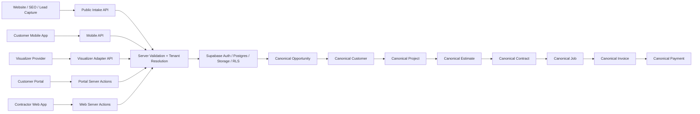
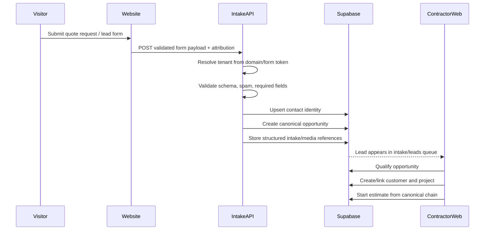
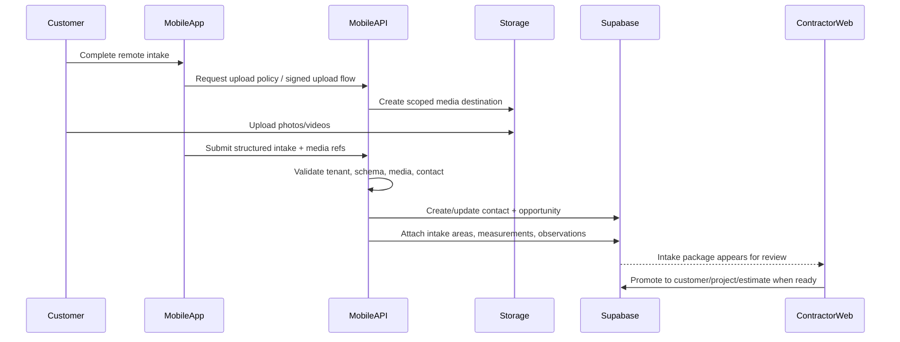

# System Integration Architecture

Status: unified architecture plan for the contractor web app, customer mobile app, website/SEO lead capture, and visualizer integration.

This is a planning document only. It does not authorize app code, schema changes, or workflow changes by itself.

Sources read:
- [docs/current-state.md](C:/FloorConnector/docs/current-state.md)
- [docs/workflows.md](C:/FloorConnector/docs/workflows.md)
- [docs/system-overview.md](C:/FloorConnector/docs/system-overview.md)
- [docs/sales-to-production.md](C:/FloorConnector/docs/sales-to-production.md)
- [docs/full-platform-feature-map.md](C:/FloorConnector/docs/full-platform-feature-map.md)

Note on uploaded Customer App architecture spec:
- No separate uploaded spec file was visible in the local workspace during this pass.
- This plan uses the requested Customer Mobile App direction from the prompt as the customer-app source concept: remote intake, customer-provided measurements/photos, lead capture handoff, and future portal continuity.

## Core Decision

All surfaces feed one canonical FloorConnector workflow:

`opportunity -> customer -> project -> estimate -> contract -> job -> invoice -> payment`

The contractor web app, customer mobile app, website/SEO system, and visualizer must be treated as different entry and interaction surfaces around that chain, not separate systems.

The recommended integration shape is:

## System Responsibilities

### FloorConnector Web App

The contractor web app is the contractor operating system.

Responsibilities:
- Own authenticated contractor workflows.
- Manage tenant-scoped canonical records.
- Review and qualify inbound intake.
- Convert qualified opportunity/intake into customer and project context.
- Build estimates from canonical catalog items and estimate line items.
- Generate contracts from approved estimates.
- Manage jobs, scheduling, invoices, payments, communications, settings, and admin.
- Provide the canonical review and correction surface when website/mobile/visualizer data needs human cleanup.

The web app must remain the primary back-office authority for workflow progression.

### Customer Mobile App

The customer mobile app is a remote-intake and customer-participation surface.

V1 responsibilities:
- Capture customer identity and contact details.
- Capture job location and service interest.
- Capture structured remote intake answers.
- Capture photos, videos, measurements, notes, and optional room/area breakdowns.
- Let returning portal customers see scoped project/request status later, if access exists.
- Submit intake packages into the shared backend.

The mobile app must not:
- become a separate CRM
- create standalone customer/project records as its own source of truth
- bypass server validation
- own estimate, contract, invoice, or payment business logic

Future responsibilities:
- customer quote-request follow-up
- customer-facing messaging
- portal-style project updates
- invoice/payment review where portal permissions allow
- visualizer-assisted selections
- appointment or site-visit request flow

### Website / SEO / Lead Capture System

The website/SEO system is the public growth surface.

Responsibilities:
- Publish public marketing and SEO pages.
- Capture lead forms, quote requests, campaign attribution, and source metadata.
- Route public submissions into the same intake API used by the customer app.
- Support contractor custom domains later without creating contractor-specific CRM silos.

The website system must create or update canonical intake context through server-side validation. It should not write directly to downstream customer, project, estimate, contract, invoice, or payment records.

### Visualizer Integration

The visualizer should be an integration attached to intake, project, estimate, and catalog context.

Recommended V1:
- Use an external visualizer provider embedded or launched from FloorConnector-controlled surfaces.
- Store provider session metadata, selected system/color/product context, output images, and customer notes as supporting intake/attachment data.
- Attach visualizer output to the canonical opportunity first when work is pre-sale.
- Attach visualizer output to the canonical project/estimate only after the opportunity has been promoted into the normal workflow.

Do not make visualizer output its own quote, project, or estimate. It is evidence and selection context that can inform the canonical estimate.

Recommended future:
- Use embedded visualizer if the provider supports secure embed, callback events, and exportable assets.
- Use external launch if embed security, mobile performance, or provider licensing makes full embed risky.
- Add provider adapters in `packages/integrations` so provider-specific logic does not leak into app pages.

## Remote Intake Model

### Final Recommended Structure

Remote intake should use `opportunities` as the canonical intake root.

Supporting intake data should be structured child data attached to the opportunity, not a second lead/customer/project system.

Recommended model:
- `opportunities`: canonical pre-project commercial record.
- `contacts`: reusable contact identity captured from website/mobile intake.
- `opportunity.primary_contact_id`: primary contact for the intake.
- `customers`: created only when qualified or explicitly promoted.
- `projects`: created only when the work is real enough to scope, estimate, or deliver.
- `remote_intake_sessions`: optional draft/session wrapper for incomplete public or mobile intake.
- `remote_intake_submissions`: submitted intake package attached to the opportunity.
- `remote_intake_areas`: structured room/garage/floor/space breakdown.
- `remote_intake_measurements`: sqft, linear footage, dimensions, and units.
- `remote_intake_media`: photos, videos, documents, or provider visualizer outputs stored in tenant-safe object storage.
- `remote_intake_observations`: substrate, coating condition, moisture, cracks, prep notes, desired finish, timing, budget, and other queryable fields.
- `remote_intake_attribution`: source, campaign, form, referrer, UTM, domain, and device metadata.

The supporting table names above are recommended architecture, not implemented status.

### Why Opportunity Is The Canonical Root

Remote intake is pre-sale and may not yet justify a customer/project.

Therefore:
- the first canonical business record should be an opportunity
- customer creation should happen on qualification or promotion
- project creation should happen when there is a real scoped job
- estimate creation should happen downstream from the opportunity/customer/project chain

This keeps website leads, mobile requests, contractor-entered leads, and future visualizer sessions in one intake lane.

## API Boundaries

### Web App Boundary

The contractor web app can continue using Next.js server actions and server-side data utilities for protected workflows.

Rules:
- Server actions validate inputs.
- Server actions resolve authenticated user, organization membership, role, and tenant scope.
- Server actions write canonical records through server-side Supabase clients.
- Shared business rules live in packages or server utilities where practical.

### Portal Boundary

The portal remains a web surface on the same backend.

Rules:
- Portal access is resolved through authenticated user, `portal_access_grants`, and `portal_project_access`.
- Portal actions may update canonical estimates, contracts, change orders, invoices, payments, and portal-view audit records only through scoped server actions.
- Portal must not create portal-only copies of customer, project, estimate, contract, invoice, or payment records.

### Mobile App Boundary

The mobile app should not call web server actions directly.

Recommended boundary:
- expose explicit mobile API route handlers or a dedicated backend-for-frontend layer
- authenticate with Supabase Auth where user identity is required
- allow public intake submission with controlled tenant resolution, rate limiting, bot protection, and server-side validation
- return DTOs shaped for mobile instead of exposing raw database rows

Mobile may use Supabase Auth for login/session, but canonical writes should go through FloorConnector APIs so the same validation, tenant scoping, dedupe, and workflow rules run everywhere.

### Website / Public Intake Boundary

Public website forms should use public intake API endpoints.

Rules:
- no direct database writes from public forms
- validate tenant/domain/form identity on the server
- rate limit and spam-check all public submissions
- normalize contact data before contact/opportunity creation
- create or update only allowed intake-level records
- downstream promotion into customer/project/estimate remains contractor-controlled or policy-controlled

### Visualizer Boundary

The visualizer should integrate through an adapter API.

Rules:
- provider callbacks are verified server-side
- provider metadata is stored as integration metadata, not business truth
- output assets are copied or referenced into tenant-safe storage according to provider terms
- selected products/systems map to canonical `catalog_items` only when a trusted mapping exists
- visualizer output can suggest estimate context but cannot create estimate line items without a contractor-reviewed action

## Shared Backend Usage

### Supabase

Supabase remains the shared backend foundation:
- authentication
- Postgres canonical records
- RLS-backed tenant isolation
- object storage for documents, intake media, estimate attachments, and future visualizer outputs

Recommended write posture:
- contractor web: server actions and server data utilities
- portal: scoped server actions and portal loaders
- mobile: explicit API route handlers backed by the same server-side helpers
- website: public intake API route handlers
- visualizer: provider callback/adapter route handlers

### Server Actions And Route Handlers

Use server actions for authenticated web/portal interactions where the caller is a Next.js surface.

Use route handlers for:
- mobile app API
- public website forms
- visualizer callbacks
- external provider webhooks
- unauthenticated or token-authenticated flows

Do not rely on client-side Supabase writes for canonical business mutations from public/mobile surfaces.

## Where Data Is Created, Validated, And Canonicalized

### Website Lead

Created:
- public website form captures raw submission

Validated:
- public intake API validates domain, tenant, form schema, required fields, spam/bot checks, and attribution metadata

Canonicalized:
- server creates or reuses `contacts`
- server creates canonical `opportunity`
- supporting intake child rows attach to the opportunity
- customer/project are created later through contractor qualification or explicit promotion

### Customer Mobile Remote Intake

Created:
- mobile app captures draft intake, media, measurements, selected services, and location

Validated:
- mobile API validates user/session or public intake token, tenant context, media rules, field schema, and submission completeness

Canonicalized:
- submitted package creates or updates canonical opportunity and contact identity
- media lands in tenant-safe storage and is referenced by intake support records
- contractor review promotes to customer/project when appropriate

### Contractor Web App

Created:
- contractor creates or edits canonical records directly inside protected workflows

Validated:
- server actions validate input, membership, role, tenant scope, status transitions, and downstream lineage rules

Canonicalized:
- records are canonical immediately after successful server-side mutation
- downstream records must link to upstream canonical IDs and snapshots

### Customer Portal

Created:
- customer actions create view events, comments/messages where supported, signature events, payment events, and approved/rejected decisions

Validated:
- portal server actions validate authenticated portal user, active grant, project access, linked-contact permissions where implemented, record status, and action-specific gates

Canonicalized:
- customer decisions update the same canonical estimate, contract, change-order, invoice, and payment chain

### Visualizer

Created:
- visualizer provider creates session, render, selected colors/systems, and output assets

Validated:
- adapter API verifies provider callback, tenant/session token, allowed records, file type, and product mapping

Canonicalized:
- visualizer output becomes supporting intake/project/estimate evidence
- catalog/product mapping becomes canonical only when linked to existing `catalog_items`
- estimate line items remain contractor-reviewed canonical estimate data

## Website To Intake To System Flow

Recommended flow:

Key rule:
- website creates opportunity-level intake, not a customer/project/estimate by default.

## Mobile App To System Flow

Recommended flow:

Key rule:
- mobile intake may be rich, but it stays upstream of customer/project/estimate until the backend or contractor promotes it.

## Visualizer Integration Point

### Recommended V1

Use an external visualizer integration with FloorConnector-managed launch and callback.

V1 integration points:
- website intake: launch visualizer before or after lead form submission, then attach output to the opportunity
- mobile app: launch visualizer as a guided intake step, then submit output with remote intake
- contractor web app: open visualizer from opportunity/project context to review or refine customer selections

V1 data handling:
- visualizer session belongs to a tenant and one source context
- before qualification, source context is opportunity/intake session
- after promotion, source context may be project or estimate
- visualizer output is stored as media/evidence
- mapped products/systems can suggest catalog items but do not automatically create estimate line items

### Future

Future embedded visualizer can be considered when:
- provider supports secure embed or SDK
- callback events are reliable
- output assets can be exported
- product/color/system selections can map safely to canonical catalog items
- mobile performance is acceptable

Future visualizer-to-estimate handoff should be contractor-reviewed:
- selected system suggests estimate scope
- selected color/product maps to catalog metadata
- contractor chooses whether to add line items or reusable systems

## Domain And DNS Strategy

Use third-party domain, DNS, hosting, and provider services without making any of them the business source of truth.

Recommended V1 provider boundary:
- Registrar: third-party registrar owns purchased domains.
- DNS: third-party DNS provider manages authoritative DNS.
- Web hosting: Vercel hosts the Next.js web app.
- Backend: Supabase hosts auth, database, storage, and RLS.
- Payments: Stripe or active payment provider handles payment sessions/webhooks, with canonical state stored in FloorConnector.
- Email/SMS later: provider sends messages, while canonical communications/notifications stay in FloorConnector.

Recommended canonical subdomain layout:
- `www.floorconnector.com`: public marketing site
- `app.floorconnector.com`: contractor web app
- `portal.floorconnector.com`: customer portal
- `api.floorconnector.com`: public/mobile/provider API boundary, if split from Next route handlers later
- `admin.floorconnector.com` or `/super-admin`: platform admin surface
- `links.floorconnector.com`: email tracking, magic links, universal links, and mobile deep links if needed

Contractor website/custom-domain strategy:
- platform-owned starter domain: `{tenant-slug}.sites.floorconnector.com`
- contractor custom domain: `www.contractor-domain.com` or `quote.contractor-domain.com`
- contractor proves ownership with DNS TXT record
- contractor points CNAME to the FloorConnector/Vercel target
- FloorConnector maps the domain to tenant/site configuration
- public forms include a server-validated site/form token so custom domains cannot spoof tenant context

Mobile deep-link strategy:
- use universal links/app links on a stable domain such as `links.floorconnector.com`
- deep links should resolve to mobile app when installed and portal/web fallback otherwise
- do not embed raw business IDs without signed tokens for customer-facing links

DNS operational rules:
- app cannot assume it controls a contractor's DNS provider
- V1 should provide DNS instructions and verification status, not automatic DNS mutation
- future provider APIs can automate DNS setup only behind an integration adapter
- auth callback, portal, and payment webhook domains must be explicitly configured per environment

## V1 Scope

### Must Be Built Now

For the first integrated architecture pass, build only the minimum that protects future scale:

- public intake API boundary for website and mobile submissions
- canonical opportunity-rooted remote intake model
- contact creation/reuse rules using `contacts`
- structured intake child data attached to opportunities
- tenant/domain/form-token resolution for public submissions
- media upload flow into tenant-safe storage
- contractor web review queue for submitted intake, using the existing leads/opportunities path
- explicit promotion path from opportunity to customer/project
- visualizer adapter shape and callback contract, even if provider integration is not live yet
- domain/DNS verification model for future contractor websites
- shared validation schemas and DTO boundaries

### Must Wait

These should wait until V1 intake is stable:

- automatic customer/project creation from every public lead
- automatic estimate generation from intake or visualizer output
- embedded visualizer implementation
- provider-specific visualizer SDK dependency in core pages
- customer self-service portal-permission management
- full website builder/CMS
- SEO automation and multi-page publishing engine
- DNS provider API automation
- mobile offline sync
- customer-visible scheduling automation
- marketing attribution analytics dashboards

### Must Not Block Future Work

V1 must leave room for:

- mobile app and website using the same intake backend
- multiple contractors with custom domains
- future quote-request permission checks
- future visualizer provider replacement
- future public website builder
- future customer portal/mobile convergence
- future automation on submitted intake
- future estimate generation assistance, without automatic canonical estimate creation
- future integration worker processing

## API Contract Shape

Recommended API families:

- `/api/public/intake`: website lead and quote request submission
- `/api/mobile/intake`: mobile remote-intake drafts/submissions
- `/api/mobile/portal`: authenticated customer mobile project/status views later
- `/api/integrations/visualizer/session`: create provider launch/session
- `/api/integrations/visualizer/callback`: verify provider callback and store output
- `/api/integrations/visualizer/assets`: receive or register output assets
- existing `/api/payments/stripe/webhook`: payment provider callback
- existing portal/server actions: portal estimate, contract, invoice, change-order actions
- existing web/server actions: contractor canonical workflows

Boundary rule:
- public/mobile/integration route handlers convert external input into validated internal commands
- internal commands use the same server-side domain/data helpers that protected web actions use

## Validation Layers

Validation must happen in layers:

1. Client validation for fast user feedback.
2. API schema validation with Zod or shared schemas.
3. Tenant/domain/form-token validation.
4. Auth/session/portal grant validation where applicable.
5. RLS-safe database writes with explicit `company_id` scoping.
6. Workflow validation before promotion into downstream canonical records.
7. Provider webhook signature validation for visualizer, payments, email, SMS, and future integrations.

The canonical moment is always server-side.

## Canonicalization Rules

Use these rules when external or customer-created data enters the system:

- Contact identity can be created from website/mobile intake.
- Opportunity can be created from website/mobile intake.
- Customer is created only when qualified/promoted.
- Project is created only when the work is real enough to scope, estimate, or deliver.
- Estimate is created by contractor workflow or explicit approved automation later, not by raw intake alone.
- Contract is generated only from approved estimate/project context.
- Job is created only from ready commercial/project context.
- Invoice is created only from approved snapshot/SOV/change-order/job/project lineage.
- Payment is created only against canonical invoices.

## Risks

Primary risks:

- Public website and mobile intake accidentally becoming a second CRM.
- Raw visualizer selections being treated like approved estimate scope.
- Custom-domain tenant resolution exposing or writing to the wrong organization.
- Mobile app writing directly to Supabase and bypassing server-side workflow validation.
- Customer/project auto-creation too early, producing duplicate accounts.
- Provider-specific visualizer logic leaking into app pages instead of integration adapters.
- Uploaded media lacking tenant-safe storage paths and lifecycle rules.
- Marketing attribution fields becoming a disconnected analytics model instead of opportunity metadata.

Mitigations:
- opportunity is the canonical intake root
- server APIs own canonical writes
- customer/project promotion is explicit
- visualizer output is supporting evidence, not estimate truth
- tenant/domain resolution is verified server-side
- provider logic lives behind adapters
- all downstream workflow records preserve the existing lifecycle chain

## Architecture Summary

The unified architecture is:

- Website and mobile app capture demand and remote context.
- Both feed a shared intake API.
- Intake becomes canonical at the opportunity level.
- Contacts are reusable identity, not customers by default.
- Contractors qualify and promote opportunities into customer/project records.
- Estimates, contracts, jobs, invoices, and payments continue through the existing canonical chain.
- Visualizer output attaches to intake/project/estimate context as evidence and selection metadata.
- Domain/DNS providers route traffic and prove ownership, but FloorConnector remains the source of workflow truth.
